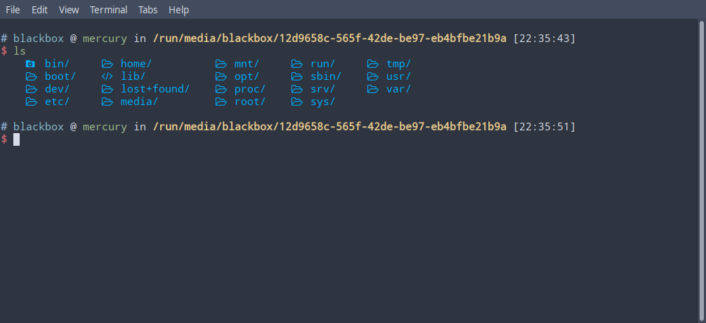
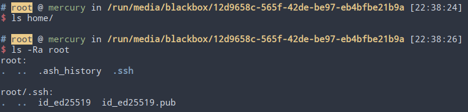

# Operation Oni
**Contest**: picoCTF 2022

**Category**: Forensics

**Challenge Link**: [picoGym Challenge](https://play.picoctf.org/practice/challenge/284)

> Download this disk image, find the key and log into the remote machine.

First launch an instance of the challenge to start the remote server and to get the disk image. The `.img` image file contains the `/boot` and `/` partitions of an Alpine Linux system. Opening up the root partition by mounting the image allows us to browse the filesystem of the system.

Looking in the `/home` directory reveals no regular user home directories. However, looking in `/root` reveals SSH keys for the `root` user on the system with the private key at `/root/.ssh/id_ed25519` and the public key at `/root/.ssh/id_ed25519.pub`.

Copying over the private key to our system will allow us to use it to access the remote server. You may have to change the file permissions on the private key using `sudo chmod 700 id_ed25519` before OpenSSH client will allow you to use it. Connect to the remote server provided in your instance with `ssh -i id_ed25519 -p [PORT_OF_YOUR_INSTANCE] ctf-player@saturn.picoctf.net` where the flag can be located in `flag.txt`.
